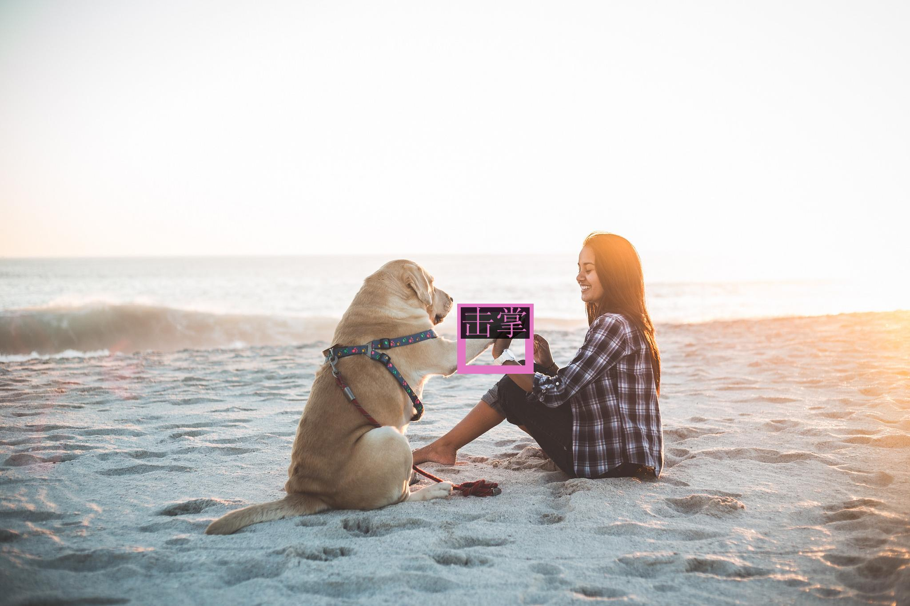
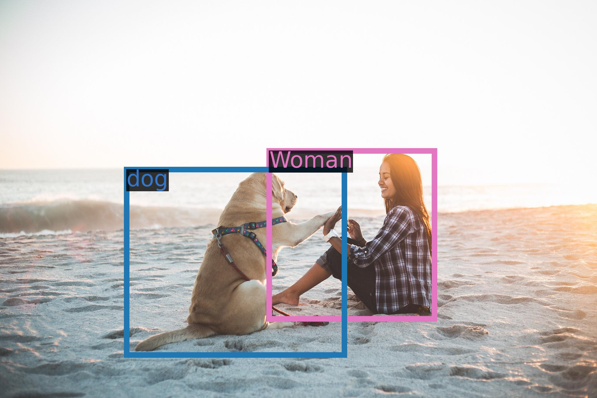

<br><br>
<h1 align="center">Chain-of-Exemplar: Enhancing Distractor Generation for Multimodal
Educational Question Generation</h1>
<p align="center">
<br>
<a href="assets/wechat.jpg">WeChat</a>&nbsp&nbsp | &nbsp&nbsp<a href="https://none">Dataset(Updating...)</a>&nbsp&nbsp | &nbsp&nbsp<a href="https://none">Checkpoints(Updating...)</a>&nbsp ｜ &nbsp<a href="https://aclanthology.org/2024.acl-long.432.pdf">Paper</a>&nbsp&nbsp
</p>
<br><br>

**Chain-of-Exemplar** is a multimodal educational multi-choice question generation framework, which utilizes multimodal large language models (MLLMs) with Chain-of-Thought reasoning to improve the generation of challenging distractors. Furthermore, CoE leverages three-stage contextualized exemplar retrieval to retrieve exemplary questions as guides for generating more subject-specific educational questions. Experimental results on the ScienceQA benchmark demonstrate the superiority of CoE in both question generation and distractor generation over existing methods across various subjects and educational levels.

<br>
<p align="center">
    
<p>
<br>


## News and Updates
* ```2024.8.16``` **Chain-of-Exemplar** has been accepted to ACL'24!

## Evaluation


## Requirements

* python 3.8 and above
* pytorch 1.12 and above, 2.0 and above are recommended
* CUDA 11.4 and above are recommended (this is for GPU users)
  <br>

## Quickstart

Below, we provide simple examples to show how to use Qwen-VL and Qwen-VL-Chat with 🤖 ModelScope and 🤗 Transformers.

Before running the code, make sure you have setup the environment and installed the required packages. Make sure you meet the above requirements, and then install the dependent libraries.

```bash
pip install -r requirements.txt
```

Now you can start with ModelScope or Transformers. More usage aboue vision encoder, please refer to the [tutorial](TUTORIAL.md).

#### 🤗 Transformers

To use Qwen-VL-Chat for the inference, all you need to do is to input a few lines of codes as demonstrated below. However, **please make sure that you are using the latest code.**

```python
from transformers import AutoModelForCausalLM, AutoTokenizer
from transformers.generation import GenerationConfig
import torch
torch.manual_seed(1234)

# Note: The default behavior now has injection attack prevention off.
tokenizer = AutoTokenizer.from_pretrained("Qwen/Qwen-VL-Chat", trust_remote_code=True)

# use bf16
# model = AutoModelForCausalLM.from_pretrained("Qwen/Qwen-VL-Chat", device_map="auto", trust_remote_code=True, bf16=True).eval()
# use fp16
# model = AutoModelForCausalLM.from_pretrained("Qwen/Qwen-VL-Chat", device_map="auto", trust_remote_code=True, fp16=True).eval()
# use cpu only
# model = AutoModelForCausalLM.from_pretrained("Qwen/Qwen-VL-Chat", device_map="cpu", trust_remote_code=True).eval()
# use cuda device
model = AutoModelForCausalLM.from_pretrained("Qwen/Qwen-VL-Chat", device_map="cuda", trust_remote_code=True).eval()

# Specify hyperparameters for generation
model.generation_config = GenerationConfig.from_pretrained("Qwen/Qwen-VL-Chat", trust_remote_code=True)

# 1st dialogue turn
query = tokenizer.from_list_format([
    {'image': 'https://qianwen-res.oss-cn-beijing.aliyuncs.com/Qwen-VL/assets/demo.jpeg'}, # Either a local path or an url
    {'text': '这是什么?'},
])
response, history = model.chat(tokenizer, query=query, history=None)
print(response)
# 图中是一名女子在沙滩上和狗玩耍，旁边是一只拉布拉多犬，它们处于沙滩上。

# 2nd dialogue turn
response, history = model.chat(tokenizer, '框出图中击掌的位置', history=history)
print(response)
# <ref>击掌</ref><box>(536,509),(588,602)</box>
image = tokenizer.draw_bbox_on_latest_picture(response, history)
if image:
  image.save('1.jpg')
else:
  print("no box")
```

<p align="center">
    
<p>

<details>
  <summary>Running Qwen-VL</summary>

Running Qwen-VL pretrained base model is also simple.

```python
from transformers import AutoModelForCausalLM, AutoTokenizer
from transformers.generation import GenerationConfig
import torch
torch.manual_seed(1234)

tokenizer = AutoTokenizer.from_pretrained("Qwen/Qwen-VL", trust_remote_code=True)

# use bf16
# model = AutoModelForCausalLM.from_pretrained("Qwen/Qwen-VL", device_map="auto", trust_remote_code=True, bf16=True).eval()
# use fp16
# model = AutoModelForCausalLM.from_pretrained("Qwen/Qwen-VL", device_map="auto", trust_remote_code=True, fp16=True).eval()
# use cpu only
# model = AutoModelForCausalLM.from_pretrained("Qwen/Qwen-VL", device_map="cpu", trust_remote_code=True).eval()
# use cuda device
model = AutoModelForCausalLM.from_pretrained("Qwen/Qwen-VL", device_map="cuda", trust_remote_code=True).eval()

# Specify hyperparameters for generation (No need to do this if you are using transformers>4.32.0)
# model.generation_config = GenerationConfig.from_pretrained("Qwen/Qwen-VL", trust_remote_code=True)

query = tokenizer.from_list_format([
    {'image': 'https://qianwen-res.oss-cn-beijing.aliyuncs.com/Qwen-VL/assets/demo.jpeg'}, # Either a local path or an url
    {'text': 'Generate the caption in English with grounding:'},
])
inputs = tokenizer(query, return_tensors='pt')
inputs = inputs.to(model.device)
pred = model.generate(**inputs)
response = tokenizer.decode(pred.cpu()[0], skip_special_tokens=False)
print(response)
# https://qianwen-res.oss-cn-beijing.aliyuncs.com/Qwen-VL/assets/demo.jpeg</img>Generate the caption in English with grounding:<ref> Woman</ref><box>(451,379),(731,806)</box> and<ref> her dog</ref><box>(219,424),(576,896)</box> playing on the beach<|endoftext|>
image = tokenizer.draw_bbox_on_latest_picture(response)
if image:
  image.save('2.jpg')
else:
  print("no box")
```

<p align="center">
    
<p>

</details>


In the event of a network issue while attempting to download model checkpoints and codes from HuggingFace, an alternative approach is to initially fetch the checkpoint from ModelScope and then load it from the local directory as outlined below:

```python
from modelscope import snapshot_download
from transformers import AutoModelForCausalLM, AutoTokenizer

# Downloading model checkpoint to a local dir model_dir
# model_dir = snapshot_download('qwen/Qwen-VL')
model_dir = snapshot_download('qwen/Qwen-VL-Chat')


# Loading local checkpoints
# trust_remote_code is still set as True since we still load codes from local dir instead of transformers
tokenizer = AutoTokenizer.from_pretrained(model_dir, trust_remote_code=True)
model = AutoModelForCausalLM.from_pretrained(
    model_dir,
    device_map="cuda",
    trust_remote_code=True
).eval()
```

#### 🤖 ModelScope

ModelScope is an opensource platform for Model-as-a-Service (MaaS), which provides flexible and cost-effective model service to AI developers. Similarly, you can run the models with ModelScope as shown below:

```python
from modelscope import (
    snapshot_download, AutoModelForCausalLM, AutoTokenizer, GenerationConfig
)
import torch
model_id = 'qwen/Qwen-VL-Chat'
revision = 'v1.0.0'

model_dir = snapshot_download(model_id, revision=revision)
torch.manual_seed(1234)

tokenizer = AutoTokenizer.from_pretrained(model_dir, trust_remote_code=True)
if not hasattr(tokenizer, 'model_dir'):
    tokenizer.model_dir = model_dir
# use bf16
# model = AutoModelForCausalLM.from_pretrained(model_dir, device_map="auto", trust_remote_code=True, bf16=True).eval()
# use fp16
model = AutoModelForCausalLM.from_pretrained(model_dir, device_map="auto", trust_remote_code=True, fp16=True).eval()
# use cpu
# model = AutoModelForCausalLM.from_pretrained(model_dir, device_map="cpu", trust_remote_code=True).eval()
# use auto
model = AutoModelForCausalLM.from_pretrained(model_dir, device_map="auto", trust_remote_code=True).eval()

# Specify hyperparameters for generation (No need to do this if you are using transformers>=4.32.0)
# model.generation_config = GenerationConfig.from_pretrained(model_dir, trust_remote_code=True)

# 1st dialogue turn
# Either a local path or an url between </img> tags.
image_path = 'https://qianwen-res.oss-cn-beijing.aliyuncs.com/Qwen-VL/assets/demo.jpeg'
response, history = model.chat(tokenizer, query=f'{image_path}</img>这是什么', history=None)
print(response)
# 图中是一名年轻女子在沙滩上和她的狗玩耍，狗的品种是拉布拉多。她们坐在沙滩上，狗的前腿抬起来，与人互动。

# 2nd dialogue turn
response, history = model.chat(tokenizer, '输出击掌的检测框', history=history)
print(response)
# <ref>"击掌"</ref><box>(211,412),(577,891)</box>
image = tokenizer.draw_bbox_on_latest_picture(response, history)
if image:
  image.save('output_chat.jpg')
else:
  print("no box")
```

<p align="center">
    
<p>
<br>

## Quantization

### Usage

We provide a new solution based on [AutoGPTQ](https://github.com/PanQiWei/AutoGPTQ), and release an Int4 quantized model for Qwen-VL-Chat, Qwen-VL-Chat-Int4 [Click here](https://huggingface.co/Qwen/Qwen-VL-Chat-Int4), which achieves nearly lossless model effects but improved performance on both memory costs and inference speed.

Here we demonstrate how to use our provided quantized models for inference. Before you start, make sure you meet the requirements (e.g., torch 2.0 and above, transformers 4.32.0 and above, etc.) and install the required packages:

```bash
pip install optimum
git clone https://github.com/JustinLin610/AutoGPTQ.git & cd AutoGPTQ
pip install -v .
```

If you meet problems installing `auto-gptq`, we advise you to check out the official [repo](https://github.com/PanQiWei/AutoGPTQ) to find a wheel.

Then you can load the quantized model easily and run inference as same as usual:

```python
model = AutoModelForCausalLM.from_pretrained(
    "Qwen/Qwen-VL-Chat-Int4",
    device_map="auto",
    trust_remote_code=True
).eval()
# Either a local path or an url between </img> tags.
image_path = 'https://qianwen-res.oss-cn-beijing.aliyuncs.com/Qwen-VL/assets/demo.jpeg'
response, history = model.chat(tokenizer, query=f'{image_path}</img>这是什么', history=None)
print(response)
```

### Performance

We illustrate the model performance of both BF16 and Int4 models on the benchmark **[TouchStone](https://github.com/OFA-Sys/TouchStone)**, and we find that the quantized model does not suffer from significant performance degradation. Results are shown below:

| Quantization | ZH         | EN            |
| ------------ | :--------: | :-----------: | 
| BF16         | 401.2      |    645.2      |
| Int4         | 386.6      |    651.4      |

### Inference Speed

We measured the average inference speed (tokens/s) of generating 1792 (2048-258) and 7934 (8192-258) tokens with the context of an image (which takes 258 tokens) under BF16 precision and Int4 quantization, respectively.

| Quantization | Speed (2048 tokens) | Speed (8192 tokens) |
| ------------ | :-----------------: | :-----------------: |
| BF16         |        28.87        |        24.32        |
| Int4         |        37.79        |        34.34        |

The profiling runs on a single A100-SXM4-80G GPU with PyTorch 2.0.1 and CUDA 11.4.

### GPU Memory Usage

We also profile the peak GPU memory usage for encoding 1792 (2048-258) tokens (including an image) as context (and generating single token) and generating 7934 (8192-258) tokens (with an image as context) under BF16 or Int4 quantization level, respectively. The results are shown below.

| Quantization | Peak Usage for Encoding 2048 Tokens | Peak Usage for Generating 8192 Tokens |
| ------------ | :---------------------------------: | :-----------------------------------: |
| BF16         |               22.60GB               |                28.01GB                |
| Int4         |               11.82GB               |                17.23GB                |

The above speed and memory profiling are conducted using [this script](https://qianwen-res.oss-cn-beijing.aliyuncs.com/profile_mm.py).
<br>

## Finetuning

Now we provide the official training script, `finetune.py`, for users to finetune the pretrained model for downstream applications in a simple fashion. Additionally, we provide shell scripts to launch finetuning with no worries. This script supports the training with DeepSpeed and FSDP. The shell scripts that we provide use DeepSpeed, and thus we advise you to install DeepSpeed before you start:

```bash
pip install deepspeed
```

### Data preparation
To prepare your training data, you need to put all the samples into a list and save it to a json file. Each sample is a dictionary consisting of an id and a list for conversation. Below is a simple example list with 1 sample:
```json
[
  {
    "id": "identity_0",
    "conversations": [
      {
        "from": "user",
        "value": "你好"
      },
      {
        "from": "assistant",
        "value": "我是Qwen-VL,一个支持视觉输入的大模型。"
      }
    ]
  },
  {
    "id": "identity_1",
    "conversations": [
      {
        "from": "user",
        "value": "Picture 1: https://qianwen-res.oss-cn-beijing.aliyuncs.com/Qwen-VL/assets/demo.jpeg</img>\n图中的狗是什么品种？"
      },
      {
        "from": "assistant",
        "value": "图中是一只拉布拉多犬。"
      },
      {
        "from": "user",
        "value": "框出图中的格子衬衫"
      },
      {
        "from": "assistant",
        "value": "<ref>格子衬衫</ref><box>(588,499),(725,789)</box>"
      }
    ]
  },
  { 
    "id": "identity_2",
    "conversations": [
      {
        "from": "user",
        "value": "Picture 1: assets/mm_tutorial/Chongqing.jpeg</img>\nPicture 2: assets/mm_tutorial/Beijing.jpeg</img>\n图中都是哪"
      },
      {
        "from": "assistant",
        "value": "第一张图片是重庆的城市天际线，第二张图片是北京的天际线。"
      }
    ]
  }
]
```
For the VL tasks, there are special tokens that are used, including ` </img> <ref> </ref> <box> </box>`.

The picture is represented as `Picture id: img_path</img>\n{your prompt}`, where `id` indicates the position of the image in the conversation, starting from 1. The "img_path" can be a local file path or a web link. 

The coordinate box is expressed as `<box>(x1,y1),(x2,y2)</box>`·, where `(x1, y1)` and `(x2, y2)` are normalized values in the range `[0, 1000)`. Its corresponding text description can be identified by `<ref>text_caption</ref>`. 


After data preparation, you can use the provided shell scripts to run finetuning. Remember to specify the path to the data file, `$DATA`.

The finetuning scripts allow you to perform:
- Full-parameter finetuning
- LoRA
- Q-LoRA

### Full-parameter finetuning
Full-parameter parameter finetuning requires updating all parameters of LLM in the whole training process. In our experiments, frozening the parameters of ViT during the fine-tuning phase achieves better performance. To launch your training, run the following script:

```bash
sh finetune/finetune_ds.sh
```

Remember to specify the correct model name or path, the data path, as well as the output directory in the shell scripts. If you want to make changes, just remove the argument `--deepspeed` or make changes in the DeepSpeed configuration json file based on your requirements. Additionally, this script supports mixed-precision training, and thus you can use `--bf16 True` or `--fp16 True`. Empirically we advise you to use bf16 to make your training consistent with our pretraining and alignment if your machine supports bf16, and thus we use it by default.

### LoRA
Similarly, to run LoRA, use another script to run as shown below. Before you start, make sure that you have installed `peft`. Also, you need to specify your paths to your model, data, and output. We advise you to use absolute path for your pretrained model. This is because LoRA only saves the adapter and the absolute path in the adapter configuration json file is used for finding out the pretrained model to load.

```bash
# Single GPU training
sh finetune/finetune_lora_single_gpu.sh
# Distributed training
sh finetune/finetune_lora_ds.sh
```

In comparison with full-parameter finetuning, LoRA ([paper](https://arxiv.org/abs/2106.09685)) only updates the parameters of adapter layers but keeps the original large language model layers frozen. This allows much fewer memory costs and thus fewer computation costs. 

Note that if you use LoRA to finetune the base language model, e.g., Qwen-VL, instead of chat models, e.g., Qwen-VL-Chat, the script automatically switches the embedding and output layer as trainable parameters. This is because the base language model has no knowledge of special tokens brought by ChatML format. Thus these layers should be updated for the model to understand and predict the tokens. Or in another word, if your training brings in special tokens in LoRA, you should set the layers to trainable parameters by setting `modules_to_save` inside the code. Additionally, we find that there is a significant gap between the memory footprint of LoRA with and without these trainable parameters. Therefore, if you have trouble with memory, we advise you to LoRA finetune the chat models. Check the profile below for more information.

### Q-LoRA
However, if you still suffer from insufficient memory, you can consider Q-LoRA ([paper](https://arxiv.org/abs/2305.14314)), which uses the quantized large language model and other techniques such as paged attention to allow even fewer memory costs. To run Q-LoRA, directly run the following script:

```bash
# Single GPU training
sh finetune/finetune_qlora_single_gpu.sh
# Distributed training
sh finetune/finetune_qlora_ds.sh
```

For Q-LoRA, we advise you to load our provided quantized model, e.g., Qwen-VL-Chat-Int4. 
You **SHOULD NOT** use the bf16 models. Different from full-parameter finetuning and LoRA, only fp16 is supported for Q-LoRA. Besides, for Q-LoRA, the troubles with the special tokens in LoRA still exist. However, as we only provide the Int4 models for chat models, which means the language model has learned the special tokens of ChatML format, you have no worry about the layers. Note that the layers of the Int4 model should not be trainable, and thus if you introduce special tokens in your training, Q-LoRA might not work.


Different from full-parameter finetuning, the training of both LoRA and Q-LoRA only saves the adapter parameters. You can load the finetuned model for inference as shown below:

```python
from peft import AutoPeftModelForCausalLM

model = AutoPeftModelForCausalLM.from_pretrained(
    path_to_adapter, # path to the output directory
    device_map="auto",
    trust_remote_code=True
).eval()
```

If you want to merge the adapters and save the finetuned model as a standalone model (you can only do this with LoRA, and you CANNOT merge the parameters from Q-LoRA), you can run the following codes:

```python
from peft import AutoPeftModelForCausalLM

model = AutoPeftModelForCausalLM.from_pretrained(
    path_to_adapter, # path to the output directory
    device_map="auto",
    trust_remote_code=True
).eval()

merged_model = model.merge_and_unload()
# max_shard_size and safe serialization are not necessary. 
# They respectively work for sharding checkpoint and save the model to safetensors
merged_model.save_pretrained(new_model_directory, max_shard_size="2048MB", safe_serialization=True)
```

Note: For multi-GPU training, you need to specify the proper hyperparameters for distributed training based on your machine. Besides, we advise you to specify your maximum sequence length with the argument --model_max_length, based on your consideration of data, memory footprint, and training speed.


### Profiling of Memory and Speed
We profile the GPU memory and training speed of both LoRA (Base) refers to training the embedding and output layer, while LoRA (Chat) has no trainable embedding and output layer) and Q-LoRA in the setup of single-GPU training. In this test, we experiment on a single A100-SXM4-80G GPU, and we use CUDA 11.8 and Pytorch 2.0. We uniformly use a batch size of 1 and gradient accumulation of 8. Each sample contains an image. We profile the memory (GB) and speed (s/iter) of inputs of different lengths, namely 384, 512, 1024, and 2048. The statistics are listed below:


<table>
    <tr>
 <th rowspan="2">Method</th><th colspan="4" align="center">Sequence Length</th>
    </tr>
    <tr>
        <th align="center">384</th><th align="center">512</th><th align="center">1024</th><th align="center">2048</th>
    </tr>
    <tr>
      <td>LoRA (Base)</td><td align="center">37.1G / 2.3s/it</td><td align="center">37.3G / 2.4s/it</td><td align="center">38.7G / 3.6s/it</td><td align="center">38.7G / 6.1s/it</td>
    </tr>
    <tr>
      <td>LoRA (Chat)</td><td align="center">23.3G / 2.2s/it</td><td align="center">23.6G / 2.3s/it</td><td align="center">25.1G / 3.5s/it</td><td align="center">27.3G / 5.9s/it</td>
    </tr>
    <tr>
        <td>Q-LoRA</td><td align="center">17.0G / 4.2s/it</td><td align="center">17.2G / 4.5s/it</td><td align="center">18.2G / 5.5s/it</td><td align="center">19.3G / 7.9s/it</td>
    </tr>

</table>

<br>

## Demo

### Web UI

We provide code for users to build a web UI demo. Before you start, make sure you install the following packages:

```
pip install -r requirements_web_demo.txt
```

Then run the command below and click on the generated link:

```
python web_demo_mm.py
```

<br>

## FAQ

If you meet problems, please refer to [FAQ](FAQ.md) and the issues first to search a solution before you launch a new issue.
<br>

## License Agreement

Researchers and developers are free to use the codes and model weights of both Qwen-VL and Qwen-VL-Chat. We also allow their commercial use. Check our license at [LICENSE](LICENSE) for more details.
<br>

## Citation

If you find our paper and code useful in your research, please consider giving a star :star: and citation :pencil: :)

```BibTeX
@article{Qwen-VL,
  title={Qwen-VL: A Versatile Vision-Language Model for Understanding, Localization, Text Reading, and Beyond},
  author={Bai, Jinze and Bai, Shuai and Yang, Shusheng and Wang, Shijie and Tan, Sinan and Wang, Peng and Lin, Junyang and Zhou, Chang and Zhou, Jingren},
  journal={arXiv preprint arXiv:2308.12966},
  year={2023}
}
```

<br>

## Contact Us

If you are interested to leave a message to either our research team or product team, feel free to send an email to qianwen_opensource@alibabacloud.com.

